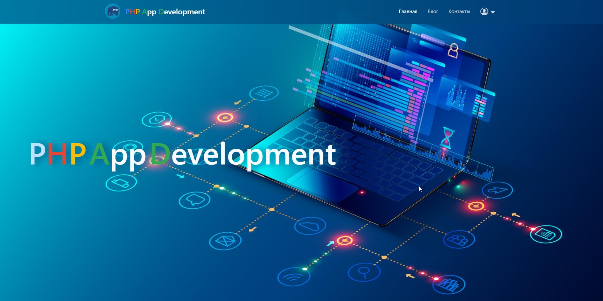
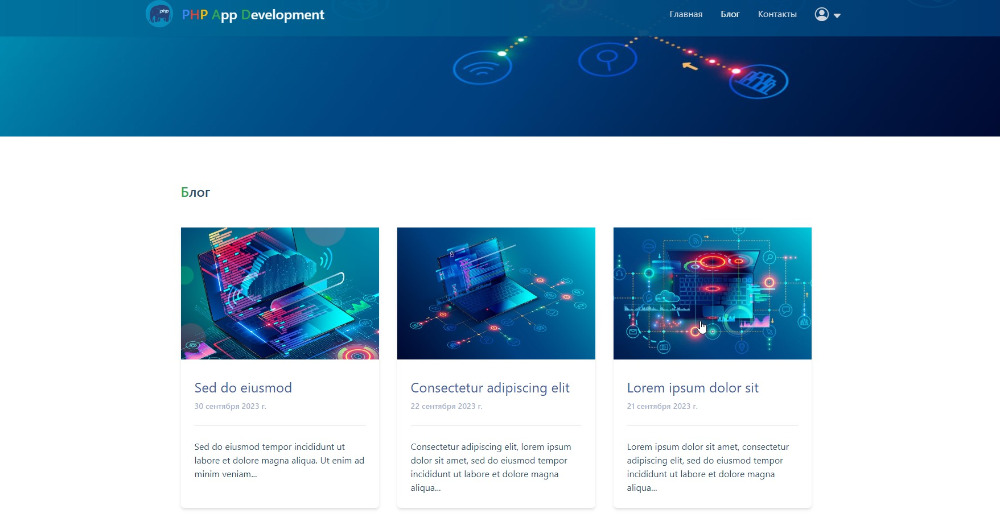
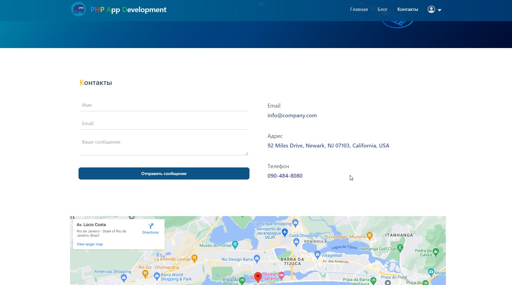
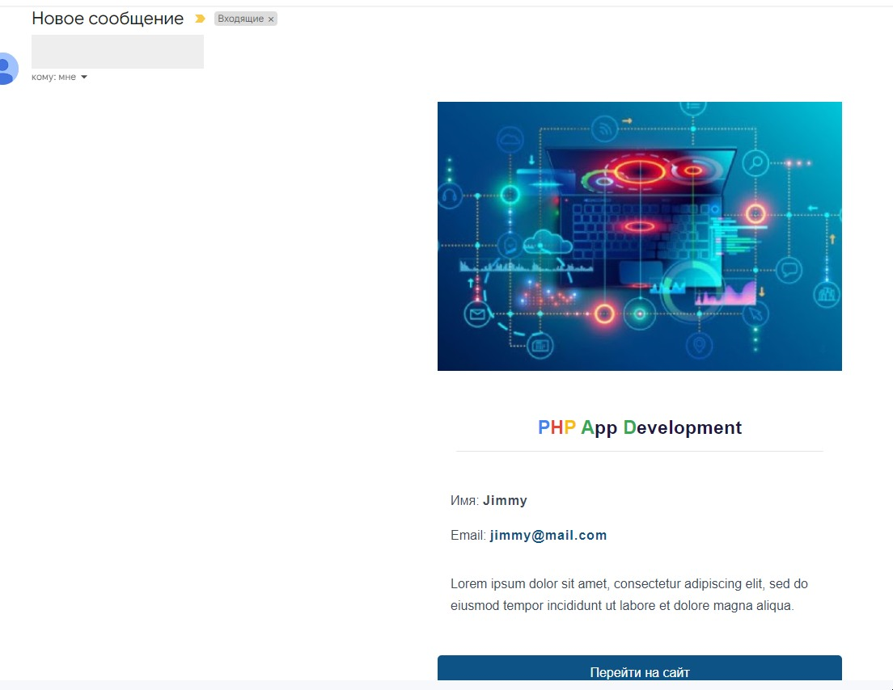
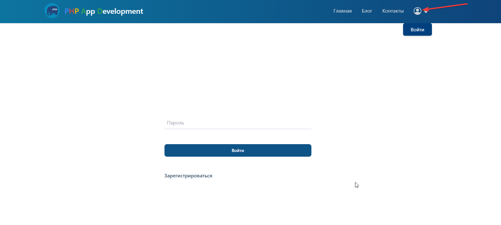
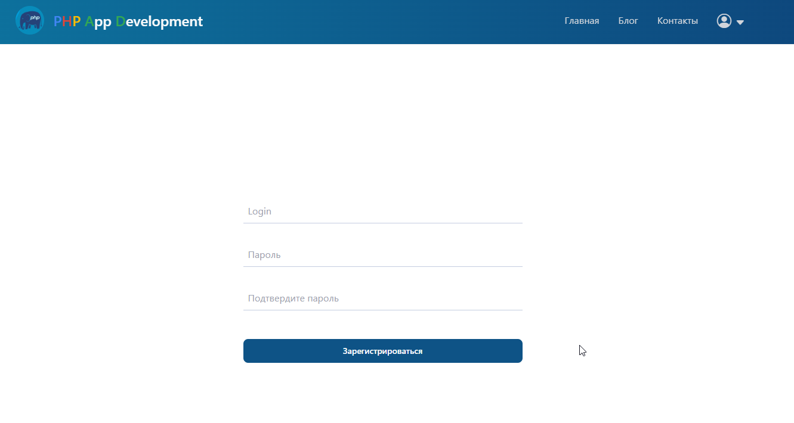
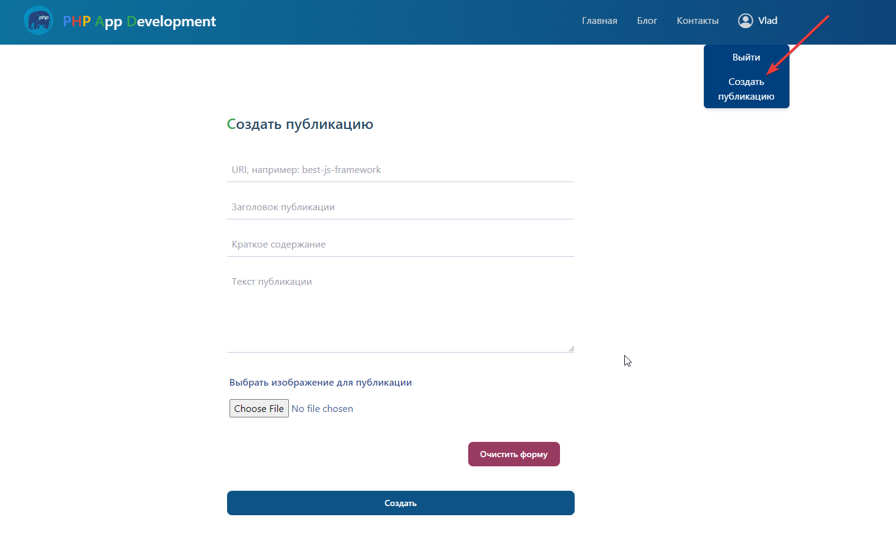
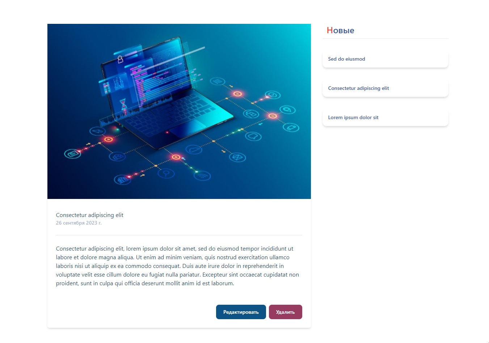
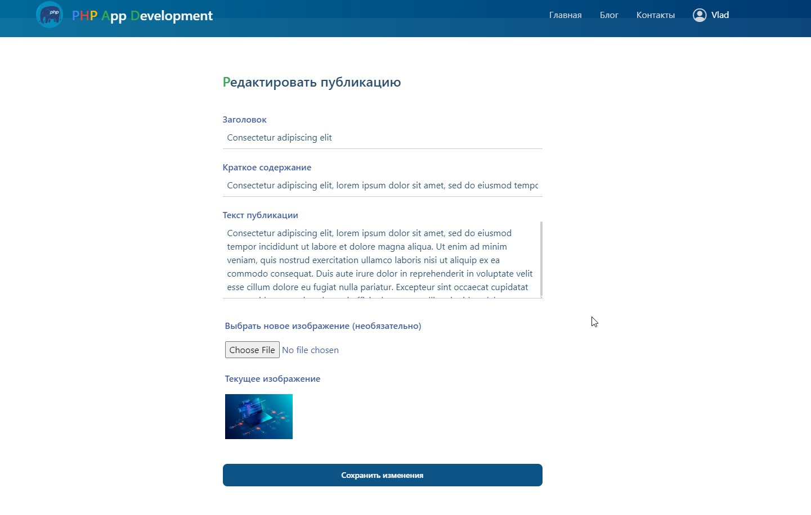

## PHP App

Цель проекта - создать приложение без использования PHP фреймворков.

Протестировать online можно здесь:

```
https://php-app.vlgroove.space/
```

При создании приложения использовались: PHP 8.1, Tailwind, jQuery, HTML5, SQL.

Главная страница:



Страница 'Блог':



Страница 'Контакты':



На странице 'Контакты' пользователь может отправить сообщение, но не больше двух.
Все поля проверяются на наличие 'плохих символов'. Поле 'email' проверяется на 
соответствие формату email адреса. 

Админ сайта получает уведомление о новом сообщении на свой email.



Можно войти на странице '/log-in':



Или зарегистрироваться на странице '/register'.
Админ сайта получает уведомление о регистрации нового пользователя на свой email.



Поле входа пользователь сможет создать свою публикацию ('post').
Все поля проверяются на наличие 'плохих символов'. Изображение проверяется на 
тип файла, размер и соотношение сторон.



Если пользователь залогинился, то он может редактировать и удалять только свои публикации.
На странице созданной им публикации появятся кнопки 'Редактировать' и 'Удалить'.





При удалении публикации или ошибке удаления директории с изображением событие
записывается в лог файл.

Ошибки при операциях с базой данных записываются в лог файл.


